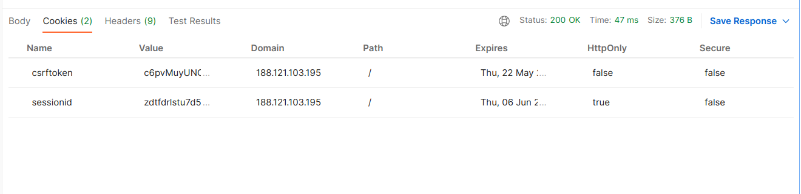
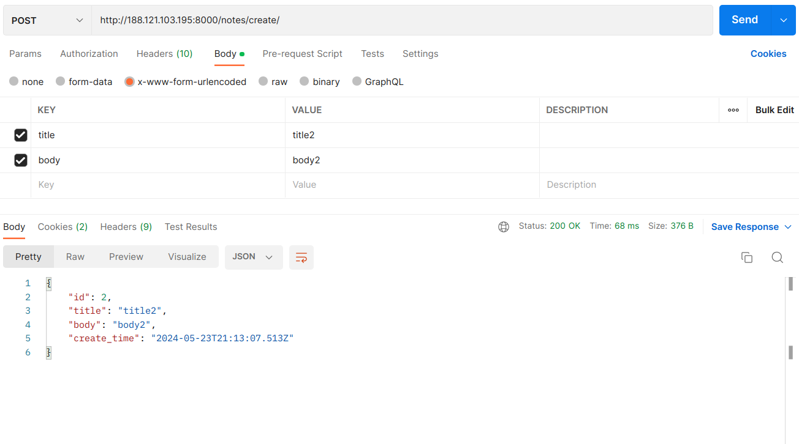
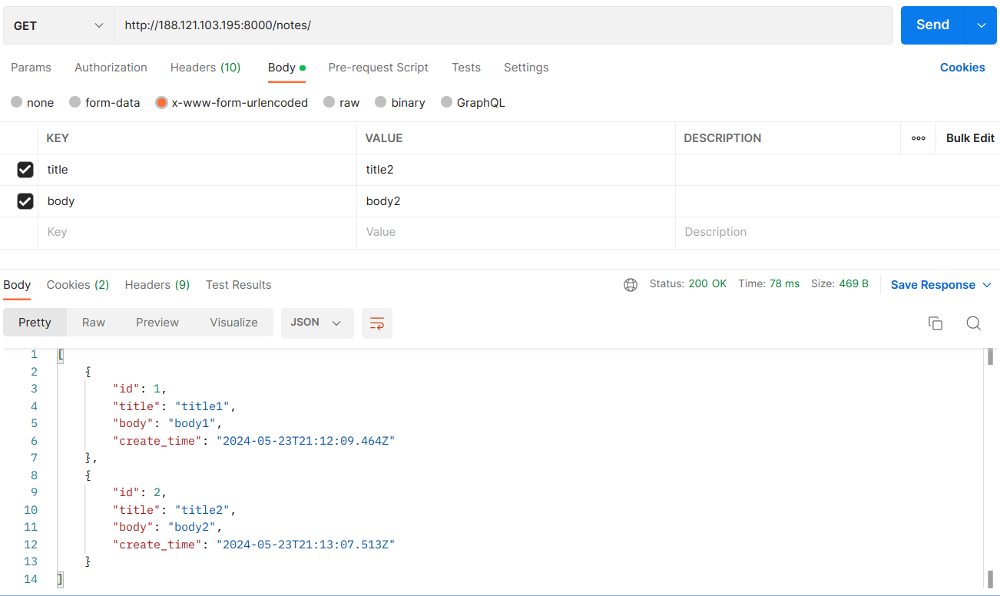
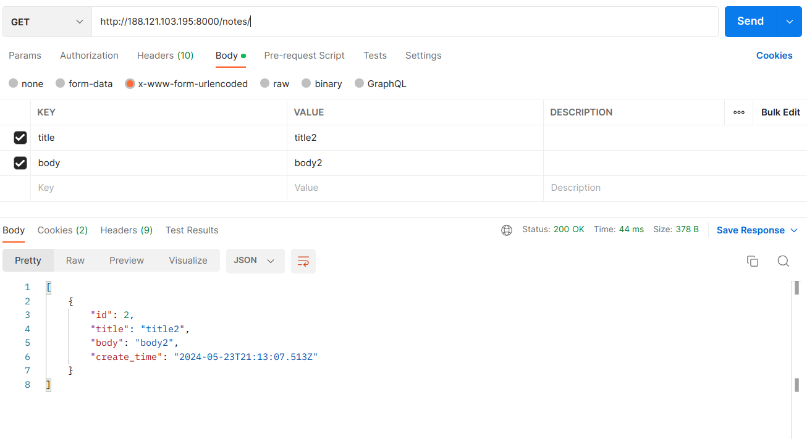
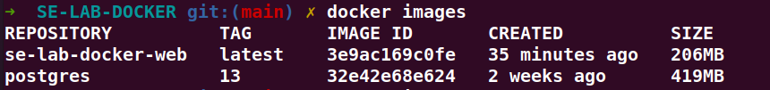
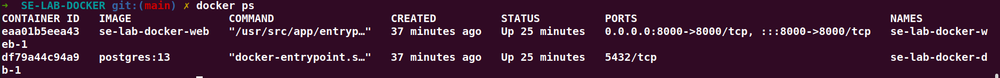
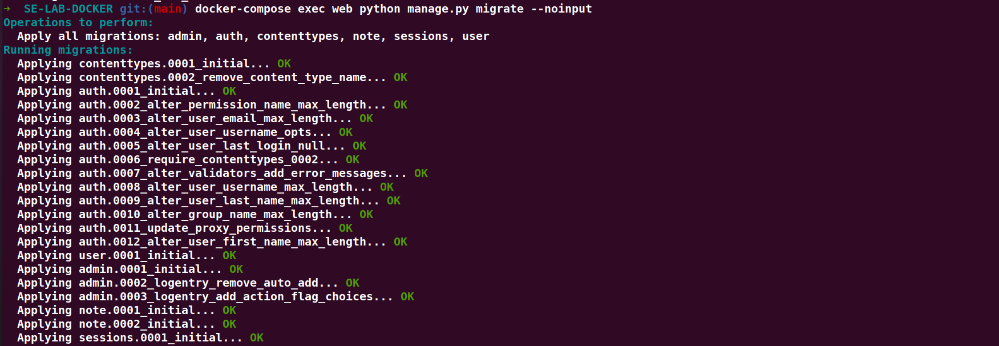

# Notes project

## Requirements
- Python3
- Postgres

## How to run

### Setup virtual environment

#### Create venv
```
python -m venv ./venv
```

#### Install requirements
```
python -m pip install -r requirements.txt
```

#### Activate venv
```
source ./venv/bin/activate
```

### Setup database
1. Create an instance of postgres database
2. Make migrations
    ```
    python manage.py makemigrations
    ```
3. Migrate
    ```
    python manage.py migrate
    ```

### Create an admin
```
python manage.py createsuperuser
```

## Important end-points
```
users/login/ --> login a user
users/me/ --> get information of logged-in user
users/create/ --> create a user
users/<id>/delete/ --> delete a user
notes/ --> list all notes of current user
notes/<id>/ --> get details of a note
notes/create/ --> create a note
notes/<id>/delete/ --> delete a note
```

## Docker

### Deployment

Run bellow commands to start the app.
```shell
docker compose up -d
docker compose up -d
``` 

<div dir="rtl">
در فایل Dockerfile تنظیمات مربوط به اپ جنگو آمده است. همان‌طور که می‌توان مشاهده کرد؛
از image: python:3.11.4-slim-buster استفاده شده‌است.
همچنین با توجه به اینکه برای شروع برنامه نیاز به آماده بودن دیتابیس postgresql داریم،
اسکریپت entrypoint.sh وجود دارد که این موضوع را بررسی می‌کند و تا زمانی که دیتابیس در دسترس نباشد اپ اجرا نمی‌شود.
با بالا آمدن دیتابیس، migrationها اجرا می‌شوند و سپس وب‌سرور جنگو اجرا می‌شود.

در فایل docker-compost.yml تنظیمات کلی برنامه مشخص شده است.
برنامه از دو جزء دیتابیس postgresql و وب‌سرور جنگو تشکیل شده است که وب‌سرور به دیتابیس وابسته است.
همچنین دیتابیس نیاز به کانفیگ اولیه (یوزر، پسورد، نام دیتابیس و ...) دارد که در این فایل آورده شده است.

</div>


### Requests to Web Server


<br>
<div dir="rtl">
برای ادامه‌ی کار لازم است توسط یوزر ساخته شده در وب‌سرور لاگین کنیم که در عکس بعدی آورده شده است. همان‌طور که مشاهده می‌شود پس از لاگین کوکی sessionid ست می‌شود
</div>
<br>










### Docker Commands

List Docker Images:
```shell
docker images
```


List Docker Containers:
```shell
docker ps
```



Run Migrations:
```shell
docker-compose exec web python manage.py migrate --noinput
```

