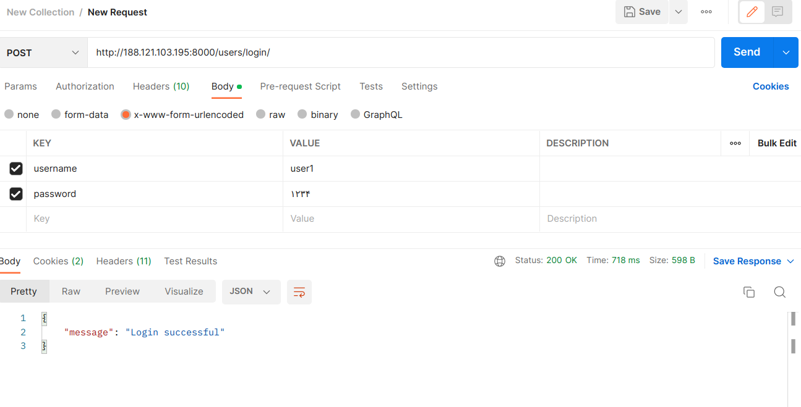

# Notes project

## Requirements
- Python3
- Postgres

## How to run

### Setup virtual environment

#### Create venv
```
python -m venv ./venv
```

#### Install requirements
```
python -m pip install -r requirements.txt
```

#### Activate venv
```
source ./venv/bin/activate
```

### Setup database
1. Create an instance of postgres database
2. Make migrations
    ```
    python manage.py makemigrations
    ```
3. Migrate
    ```
    python manage.py migrate
    ```

### Create an admin
```
python manage.py createsuperuser
```

## Important end-points
```
users/login/ --> login a user
users/me/ --> get information of logged-in user
users/create/ --> create a user
users/<id>/delete/ --> delete a user
notes/ --> list all notes of current user
notes/<id>/ --> get details of a note
notes/create/ --> create a note
notes/<id>/delete/ --> delete a note
```

## Docker

### Deployment

Run bellow commands to start the app.
```shell
docker compose up -d
docker compose up -d
``` 

<div dir="rtl">
در فایل Dockerfile تنظیمات مربوط به اپ جنگو آمده است. همان‌طور که می‌توان مشاهده کرد؛
از image: python:3.11.4-slim-buster استفاده شده‌است.
همچنین با توجه به اینکه برای شروع برنامه نیاز به آماده بودن دیتابیس postgresql داریم،
اسکریپت entrypoint.sh وجود دارد که این موضوع را بررسی می‌کند و تا زمانی که دیتابیس در دسترس نباشد اپ اجرا نمی‌شود.
با بالا آمدن دیتابیس، migrationها اجرا می‌شوند و سپس وب‌سرور جنگو اجرا می‌شود.

در فایل docker-compost.yml تنظیمات کلی برنامه مشخص شده است.
برنامه از دو جزء دیتابیس postgresql و وب‌سرور جنگو تشکیل شده است که وب‌سرور به دیتابیس وابسته است.
همچنین دیتابیس نیاز به کانفیگ اولیه (یوزر، پسورد، نام دیتابیس و ...) دارد که در این فایل آورده شده است.

</div>


### Requests to Web Server


<br>
<div dir="rtl">
برای ادامه‌ی کار لازم است توسط یوزر ساخته شده در وب‌سرور لاگین کنیم که در عکس بعدی آورده شده است. همان‌طور که مشاهده می‌شود پس از لاگین کوکی sessionid ست می‌شود
</div>
<br>




### Docker Commands

List Docker Images:
```shell
docker images
```


List Docker Containers:
```shell
docker ps
```


Run Migrations:
```shell
docker-compose exec web python manage.py migrate --noinput
```


### پاسخ پرسش ها:

در Docker، سه مفهوم اساسی وجود دارد که هر کدام وظیفه و نقش خاص خود را دارند: Dockerfile، Image، و Container. در ادامه این سه مفهوم را با یکدیگر مقایسه می‌کنیم:

### Dockerfile
- **وظیفه**: Dockerfile یک فایل متنی است که شامل دستورالعمل‌هایی برای ساخت یک Docker image می‌باشد. این فایل مشخص می‌کند که چه نرم‌افزارها، کتابخانه‌ها، و تنظیماتی باید در image قرار گیرند.
- **محتوا**: Dockerfile شامل دستورات و تنظیماتی مانند FROM (برای مشخص کردن پایه image)، RUN (برای اجرای دستورات در حین ساخت image)، COPY (برای کپی فایل‌ها به image)، و CMD (برای تعیین فرمان پیش‌فرض در زمان اجرای container) می‌باشد.
- **مثال**:
  ```dockerfile
  FROM python:3.8-slim
  WORKDIR /app
  COPY . /app
  RUN pip install -r requirements.txt
  CMD ["python", "app.py"]
  ```

### Image
- **وظیفه**: Image یک بسته‌ای ثابت و قابل حمل است که شامل تمام اطلاعات و نرم‌افزارهای لازم برای اجرای یک برنامه می‌باشد. Image نتیجه نهایی اجرای Dockerfile است.
- **ویژگی‌ها**: Image‌ها لایه‌مند هستند، به این معنی که از چندین لایه ساخته می‌شوند که هر کدام تغییرات خاصی را نسبت به لایه قبلی اعمال می‌کنند. Image‌ها تغییرناپذیر (immutable) هستند و می‌توانند برای ساخت container‌ها استفاده شوند.
- **مثال**: وقتی شما Dockerfile خود را با استفاده از دستور `docker build` اجرا می‌کنید، یک Docker image ساخته می‌شود که می‌تواند به نام خاصی برچسب‌گذاری شود (مثلاً my-python-app:latest).

### Container
- **وظیفه**: Container یک نمونه اجرایی (runtime instance) از یک Docker image است. Container یک محیط ایزوله شده است که برنامه را اجرا می‌کند.
- **ویژگی‌ها**: Container‌ها می‌توانند اجرا، توقف، و حذف شوند بدون اینکه به image اصلی آسیبی برسد. آن‌ها مانند یک فرآیند جداگانه در سیستم عمل می‌کنند که محیط اجرای آن توسط Docker مدیریت می‌شود.
- **مثال**: با استفاده از دستور `docker run`, شما می‌توانید یک container از یک image خاص ایجاد و اجرا کنید:
  ```sh
  docker run -d --name my-python-app-container my-python-app:latest
  ```

### مقایسه وظایف
- **Dockerfile**: وظیفه ایجاد دستورالعمل‌های ساخت image.
- **Image**: وظیفه فراهم کردن یک بسته ثابت و قابل حمل شامل تمامی موارد لازم برای اجرای برنامه.
- **Container**: وظیفه اجرای واقعی برنامه در محیط ایزوله شده بر اساس image.

### نتیجه‌گیری
هر سه مفهوم Dockerfile، Image و Container نقش‌های مکمل دارند. Dockerfile برای تعریف ساختار و محتویات Image استفاده می‌شود، Image نتیجه نهایی از اجرای Dockerfile است که می‌تواند در هر سیستمی اجرا شود، و Container نمونه اجرایی از آن Image است که برنامه را در یک محیط ایزوله شده اجرا می‌کند.

### سوال دوم:

Kubernetes یک سیستم متن‌باز برای اتوماسیون استقرار، مقیاس‌بندی و مدیریت برنامه‌های کانتینریزه شده است. در ادامه به برخی از کارهایی که می‌توان با Kubernetes انجام داد و رابطه آن با Docker اشاره می‌کنیم:

### کاربردهای Kubernetes
1. **استقرار کانتینرها (Container Deployment)**:
   - Kubernetes به شما اجازه می‌دهد تا به‌راحتی کانتینرهای خود را در چندین سرور (کلاستر) مستقر کنید.

2. **مقیاس‌بندی (Scaling)**:
   - شما می‌توانید به‌صورت خودکار یا دستی تعداد کانتینرهای در حال اجرا را افزایش یا کاهش دهید تا با حجم کاری و ترافیک موجود هماهنگ شوید.

3. **مدیریت کانتینرها (Container Management)**:
   - Kubernetes فرآیندهای مربوط به اجرای کانتینرها را مدیریت می‌کند، از جمله آغاز مجدد (restart) کانتینرهای خراب شده و جابجایی (migration) کانتینرها به سرورهای دیگر در صورت نیاز.

4. **تعادل بار (Load Balancing)**:
   - Kubernetes به‌طور خودکار ترافیک شبکه را بین کانتینرهای فعال توزیع می‌کند تا اطمینان حاصل شود که هیچ کدام از کانتینرها بار بیش از حدی ندارند.

5. **ذخیره‌سازی پایدار (Persistent Storage)**:
   - Kubernetes می‌تواند به کانتینرها دسترسی به ذخیره‌سازی پایدار را فراهم کند تا داده‌ها حتی پس از خاموش شدن کانتینرها حفظ شوند.

6. **خودشفا (Self-healing)**:
   - Kubernetes می‌تواند کانتینرهای خراب را شناسایی و مجدداً راه‌اندازی کند، کانتینرهای سالم را جایگزین کند و نودهای غیرقابل استفاده را از کلاستر حذف کند.

7. **پیکربندی و مدیریت رازها (Configuration and Secret Management)**:
   - Kubernetes امکان مدیریت پیکربندی‌ها و اطلاعات حساس (مثل API keys و passwordها) را بدون نیاز به وارد کردن آن‌ها در کدهای برنامه فراهم می‌کند.

### رابطه Kubernetes با Docker
- **Docker به عنوان Runtime**:
  - Docker یکی از محبوب‌ترین runtime‌ها برای اجرای کانتینرها است و Kubernetes می‌تواند از Docker به‌عنوان محیط اجرای کانتینرها استفاده کند.
  
- **Kubernetes مدیریت می‌کند، Docker اجرا می‌کند**:
  - Kubernetes مسئول مدیریت چرخه حیات کانتینرها، مقیاس‌بندی، تعادل بار و سایر جنبه‌های اجرایی است، در حالی که Docker وظیفه اجرای کانتینرها را بر عهده دارد.

- **Docker CLI در مقابل Kubernetes CLI**:
  - Docker CLI برای مدیریت کانتینرها در یک ماشین استفاده می‌شود، در حالی که Kubernetes CLI (kubectl) برای مدیریت کانتینرها در یک کلاستر استفاده می‌شود.

### نتیجه‌گیری
Kubernetes و Docker مکمل یکدیگر هستند؛ Kubernetes مدیریت و هماهنگی کانتینرها را در سطح کلاستر انجام می‌دهد، در حالی که Docker محیطی را برای ساخت و اجرای کانتینرها فراهم می‌کند. با استفاده از Kubernetes، می‌توان مقیاس‌پذیری، قابلیت اطمینان و مدیریت آسان‌تری برای برنامه‌های کانتینریزه شده داشت.
